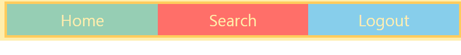

# POSITION
## 1. relative
- 상대좌표: **원래 위치**에서 top, left, right, bottom으로 이동<br><br>

## 2. absolute
- 상위 부모의 포지션이 **static(기본포지션)** 이 아닐때 **부모의 좌표**에서 이동<br><br>

## 3. fixed
- 화면이 커지나 작아지나 고정
***
# OVERFLOW
### css overflow의 속성은 4가지(visible, hidden, scroll, auto)가 있다.<br><br>

## 1. visible
- (기본값) 내용이 넘칠경우 상자 밖으로 보여집니다.<br><br>

## 2. hidden
- 넘치는 부분은 잘려서 보이지 않습니다.<br><br>

## 3. scroll
- 스크롤 바가 생겨 스크롤 할 수 있습니다.<br><br>

## 4. auto
- 내용이 넘치는 경우 스크롤 바가 생깁니다.
***
# FLEX-BOX
```
display: flex;
align-items: center;
justify-content: center;
```
### 디스플레이를 플렉스로 바꾸고 가로(justify-content) 세로(align-items) 센터로 정렬
***
## 1. justify-content
```
.container {
    display: flex;
    justify-content: center;
```

### justify-content의 속성 중 center 이용

### justify-content의 속성 중 space-around 이용

### justify-content의 속성 중 space-between 이용
***
## 2. align-items
### align-items의 속성
1. stretch : 기본 설정으로, 플렉스 요소의 높이가 플렉스 컨테이너의 높이와 같게 변경된 뒤 연이어 배치됩니다.

2. flex-start : 플렉스 요소는 플렉스 컨테이너의 위쪽에 배치됩니다.

3. flex-end : 플렉스 요소는 플렉스 컨테이너의 아래쪽에 배치됩니다.

4. center : 플렉스 요소는 플렉스 컨테이너의 가운데에 배치됩니다.

5. baseline : 플렉스 요소는 플렉스 컨테이너의 기준선(baseline)에 배치됩니다.
```
.container {
    display: flex;
    height: 50vh; // 전체화면의 50프로를 차지
```

## 기본(stretch)
```
.container {
    display: flex;
    align-items: center;
    height: 50vh;
```
## align-items의 속성 중 center 이용

## align-items의 속성 중 flex-end 이용

***
# FLEX
```
flex: 1;
```


### - 부모컨텐츠에 flex: 1; 로 주게 되면 자식컨텐츠들은 각 1만큼의 공간을 차지하도록 바뀐다.<br><br>
### - 자식컨텐츠 중 어느 하나만 2로 주게되면 2만큼 더 큰 공간을 차지하게 바뀐다.

# Z-INDEX
```
z-index: 1; //정의된 숫자가 클수록 앞으로 오게됨
```
***
# BORDER
```
.box3{ border: 5px solid orange;}
.box4{ border: 5px dashed blueviolet;}
.box5{ border: 5px dotted cornflowerblue;}
```
## 1. solid
- 보더를 직선형태로 설정한다.
## 2. dashed
- 보더를 긴 점선으로 설정한다.
## 3. dotted
- 보더를 점선으로 설정한다.
***
# table
```
<!DOCTYPE html>
<html lang="en">
<head>
    <meta charset="UTF-8">
    <meta name="viewport" content="width=device-width, initial-scale=1.0">
    <title>테이블</title>
    <style>
        table, td, th {
            border: 1px solid black;
        }
        tr:nth-child(odd){
            background-color: greenyellow;
        }
        tr:nth-child(even){
            background-color: blue;
        }
        tr:hover{
            background-color: pink;
        }  
    </style>

</head>
<body>
    <div>
        <table>
            <tr>
                <th>1행 1열</th>
                <td>1행 2열</td>
            </tr>
            <tr>
                <td>2행 1열</td>
                <td>2행 2열</td>
            </tr>
        </table>
    </div>    
</body>
</html>
```

### tr은 행, td는 열, th는 진하게 설정
### tr 짝수(even)는 배경색이 blue
### tr 홀수(odd)는 배경색이 greenyellow

### tr에 마우스가 올라가면 배경색이 pink로 바뀜
***
# unsplash random image
```


```
### animal 대신 nature 넣고 해서 테마를 바꿀수 있음
***
# transform, transition
```
.container img:hover {
    transform: scale(1.1);
    transition: all 0.1s;
}
```

### 그림이 hover 되었을때 transform으로 1.1배 커지게하고<br> transition으로 0.1초만에 커지게 애니매이션을 넣었음
# grid
## Flexible Box는 단순한 1차원 레이아웃을 위한것이고 Grid(그리드)는 2차원(행과 열)의 레이아웃 시스템을 위한것입니다.<br><br>
### 1. 틀을 200px, 100px, 200px, auto씩 줌<br><br>
```
.grid {
display: grid;
grid-template-columns: 200px 100px 200px auto;
}
```

### 2. 화면크기의 비율을 1, 2, 3씩 줌<br><br>
```
.grid {
display: grid;
grid-template-columns: 1fr 2fr 3fr;
}
```

### 3. 3등분해서 1씩 반복, gap으로 간격을 3px씩 줌 세로갭(column-gap), 가로갭(row-gap)이 있다.<br><br>
```
.grid {
display: grid;
grid-template-columns: repeat(3, 1fr);
gap: 3px;
}
```

### 4. auto-fit으로 주면 mixmax에 설정한 값대로 자동으로 repeat해준다.
``` 
grid-template-columns: repeat(auto-fit, minmax(200px, 1fr));
```
### 5. grid-column, grid-row로 합쳐준다.
```
.item:first-child {
    grid-column: 1/4;
    grid-row: 1/3;
}
.item:nth-child(9){
    grid-column: 2/5;
    grid-row: 4/6;
}
```
