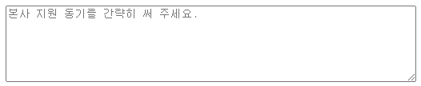

# placeholder, required, autofocus

```
<textarea name="" id="" cols="70" rows="6" placeholder="본사 지원 동기를 간략히 써 주세요." required></textarea>
```
## placeholder
- 이 컨턴츠에 대한 설명을 간닥히 적으며 사용자가 이용하려고 클릭시 사라진다.
## required
- required을 적어놓은 컨텐츠를 사용자가 적지 않으면 안되게 경고창이 뜨게 설정할 수 있다.
## autofocus
- 프로그램 실행시 커서, 포인트가 이곳에 위치하게 설정할 수 있다.
# buttom type의 submit, reset
```
<button type="submit" >접수하기</button>
<button type="reset" >다시쓰기</button>
```
## submit기능은 데이터를 어디로 넘길때 쓰는 type이다.
## reset기능은 그 페이지 모든기능을 초기화 시킬때 쓰는 type이다.
# 클릭시 원하는 위치로 이동시키는 방법
```
<ul id="menu">
<a href="#menu">[메뉴로]</a>
```
### 원하는 위치에 id를 주고 a태그를 이용해<br> a href="#menu"<br>설정하면 클릭시 해당위치로 루프한다.